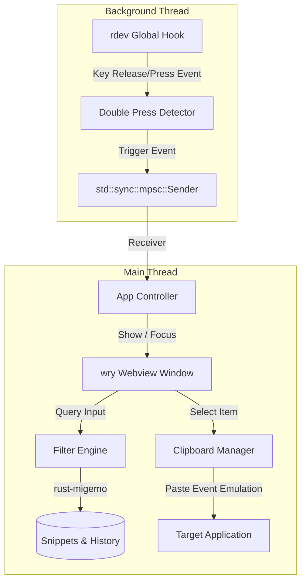

# プロジェクト仕様書：Rust製 高生産性スニペット＆クリップボード管理ツール

## 1. 概要
Windows環境で動作する、タスクトレイ常駐型の生産性向上ツール。キーボードショートカット（連打）をトリガーに、スニペットの挿入やクリップボード履歴の呼び出しを、C/Migemo を用いた高速インクリメンタルサーチで行う。

## 2. システム構成

### 2.1. スレッド / プロセスモデル
* **メインスレッド (GUI/Webview):** `tao` + `wry` を使用。通常は非表示状態でタスクトレイに常駐し、トリガー検知時に瞬時にウィンドウを可視化・フォーカスする。
* **キーボード監視スレッド (グローバル・フック):** `rdev` を使用してバックグラウンドでキー入力を監視。特定の連打パターンを検出した際、チャネル（`std::sync::mpsc`）を通じてメインスレッドに可視化イベントを送信する。
* **検索エンジン (Rust側):** Webview UI からのクエリ入力を受け取り、`rust-migemo` を用いてローマ字から日本語の正規表現パターンを生成。高速にスニペットや履歴のフィルタリングを行い、結果をUIに反映する。

## 3. トリガーと機能
| 機能 | トリガー | 主な処理 |
| :--- | :--- | :--- |
| **スニペット挿入** | `Shift` × 2回 (300ms以内) | fzf風UIを起動。テンプレートから動的生成しクリップボード経由で自動ペースト。 |
| **クリップボード履歴** | `Ctrl` × 2回 (300ms以内) | fzf風UIを起動。直近のコピー履歴を検索し、選択項目を自動ペースト。 |

## 4. 技術スタック
* **言語:** Rust
* **GUI / UI:** `tao` + `wry` (Webview)
* **キーボード監視:** `rdev` (グローバル・フック)
* **テンプレート:** `minijinja`
* **検索・絞り込み:** `rust-migemo` (C/Migemo バインディング)
* **クリップボード:** `arboard`
* **常駐制御:** `tray-icon`

## 5. 詳細仕様

### 5.1. UI/UX・操作感仕様 (fzfライクなインタラクション)
* **ウィンドウの表示とフォーカス:**
  * トリガー検知時、現在アクティブなテキストエディタのキャレット（カーソル）位置の直下、または画面中央（設定で選択可能）に、タイトルバーや枠線のないボーダーレスな小型検索ウィンドウを瞬時にポップアップする。
  * ウィンドウ表示と同時に、最前面への配置およびクエリ入力ボックスへのオートフォーカスを行う。
* **キーバインド:**
  * `Up` / `Down` または `Ctrl + P` / `Ctrl + N` (もしくは `Ctrl + K` / `Ctrl + J`): 候補リストの選択移動。
  * `Enter`: 現在選択中の候補を決定する。
  * `Esc` または `Ctrl + [ `: 決定せずにウィンドウを非表示（非活性化）にする。
  * ウィンドウ外部をクリックした際（フォーカスアウト時）も、自動的に非表示にする。
* **決定時の挙動:**
  * 決定時、対象テキストをクリップボードに格納した直後、アクティブだったアプリケーションに対して `Ctrl + V` キー入力エミュレーションを送信して自動ペーストし、ウィンドウを非表示にする。

### 5.2. クリップボード履歴の仕様
* **容量制限:** 最大 100 件（設定ファイルでカスタマイズ可能）。
* **対象データ:** プレーンテキストのみ（画像やファイルオブジェクトは対象外、またはファイルパスのテキスト化のみを保持）。
* **重複排除:** すでに履歴に存在する文字列がコピーされた場合、重複したアイテムは作成せず、既存のアイテムを最新（最上位）へ移動する。
* **永続化:**
  * アプリケーション終了時、またはコピー検知時に `%APPDATA%\clipper\history.json` に保存する。
  * セキュリティ配慮として、指定された文字数以上のアイテムや、特定のパターン（パスワードやクレジットカード番号等）を検出した場合は履歴への保存を除外するフィルタ機能を設ける。

### 5.3. スニペット機能の仕様
* **テンプレート管理:**
  * デフォルトテンプレートは `include_bytes!` でバイナリに内包。
  * ユーザー定義のカスタムスニペットは、 `%APPDATA%\clipper\snippets\` ディレクトリ内のテンプレートファイル（`.j2` 等）から実行時に動的に読み込む。
* **テンプレート（minijinja）で利用可能な動的変数:**
  * `{{ datetime }}`: 現在の日時。
  * `{{ clipboard }}`: 直前のクリップボードの中身（プレーンテキスト）。

### 5.4. キー監視と連打判定
* **判定ロジック:**
  * `Shift` または `Ctrl` キーの単体押下・解放を監視。300ms以内の同一キーの連続入力を「連打」と判定する。
  * 他のキー（文字入力キー等）が間に挟まれた場合は、ミリ秒タイマーを即座にリセットする。これにより、`Shift + A` や `Ctrl + C` などの通常のショートカット操作との競合を回避し、完全な透過フックを実現する。

### 5.5. 辞書と配布の仕様
* **C/Migemo 辞書ファイルの同梱:**
  * 実行ポータビリティ向上のため、C/Migemoの辞書ファイルは `include_bytes!` にてバイナリ内に圧縮して埋め込む。
  * 初回起動時に自動で `%APPDATA%\clipper\dict\` に展開し、それ以降は展開された辞書ファイルを読み込む。

## 6. 実装フェーズ詳細

### Phase 1: 基盤構築
* `rdev` を使用したバックグラウンド・キー入力監視と、300ms以内の連打判定ロジックの実装。
* `tray-icon` を利用したタスクトレイメニューの実装。
* `std::sync::mpsc` を用いたキー監視スレッドからメインスレッドへのイベント伝搬の実装。

### Phase 2: UIとレンダリング
* `wry` による不可視ウィンドウの起動と、イベント受信時の可視化・最前面化・オートフォーカス処理。
* HTML/CSS/JS で構築する fzf 風の検索 UI（矢印キーや `Ctrl + P/N` によるリスト移動、`Enter`/`Esc` 操作）の実装。

### Phase 3: インクリメンタルサーチの統合
* `rust-migemo` を用いたクエリの正規表現変換と、Rust側での高速フィルタリング。

### Phase 4: 機能の実装
* **スニペット:** `%APPDATA%` からの動的読み込みと、`minijinja` でのテンプレートレンダリング。
* **履歴:** `VecDeque` による履歴保持と `%APPDATA%` への JSON 永続化、重複排除。

## 7. 注意事項
* **権限:** グローバルキーボードフックを使用するため、実行時には管理者権限が必要となる場合があります。
* **キーエミュレーション:** 自動ペースト時の `Ctrl + V` エミュレーションは、対象のウィンドウが完全にフォーカスを取り戻したタイミングで行う必要があるため、微小なディレイ調整が必要です。