# Alt + Key Shortcut Selection Implementation Plan

> **For agentic workers:** REQUIRED SUB-SKILL: Use superpowers:subagent-driven-development to implement this plan task-by-task. Steps use checkbox (`- [ ]`) syntax for tracking.

**Goal:** Implement key selection shortcuts (`Alt` + `1`..`9`, `0`, `A`..`Z`) mapped dynamically to the visible list viewport, with keycap labels displayed in the owner-drawn list.

**Architecture:**
In `main.rs` message loop, trap `WM_SYSKEYDOWN` and map the key to a relative viewport index. Auto-trigger the select/copy logic. In `wndproc.rs` `WM_DRAWITEM` handler, calculate the visible row relative index and render a keycap label on the left side, shifting text and folder icons to the right.

**Architecture Diagram:**

```mermaid
graph TD
    subgraph "Message Loop (main.rs)"
        ML[GetMessageW Loop] -->|is_visible & WM_SYSKEYDOWN| SYSKEY[Check msg.wparam]
        SYSKEY -->|Match 1..9, 0, A..Z| IDX[get_shortcut_index]
        IDX -->|target_idx < count| SEL[LB_SETCURSEL & ui::on_select]
    end

    subgraph "Owner-Draw List (wndproc.rs)"
        DRAW[WM_DRAWITEM Handler] -->|Get top_index| TOP[LB_GETTOPINDEX]
        TOP -->|relative_idx = item_id - top_index| CHAR[Lookup SHORTCUT_CHARS]
        CHAR -->|Some| KEYCAP[Render Keycap Label]
        KEYCAP -->|Shift right| TXT[Render Icon & Text]
    end
```


## Global Constraints
- Always use `rtk` prefix for compilation and testing.
- Maintain existing codebase styling and formatting rules.

---

## Tasks

### Task 1: Implement Key Interception in Message Loop
Add hotkey message trapping inside the main event loop.

**Files:**
- Modify: [src/main.rs](file:///D:/Develop/clipper/src/main.rs)

**Interfaces:**
- Consumes: `state::lock_state()`, `ui::on_select()`
- Produces: Alt-key handler in dialog message loop

- [ ] **Step 1: Implement virtual key translation**
  Add the `get_shortcut_index` helper at the top of [src/main.rs](file:///D:/Develop/clipper/src/main.rs) (or inside the module):
  ```rust
  fn get_shortcut_index(wparam: usize) -> Option<usize> {
      if (0x31..=0x39).contains(&wparam) {
          // '1'..'9'
          Some(wparam - 0x31)
      } else if wparam == 0x30 {
          // '0'
          Some(9)
      } else if (0x41..=0x5A).contains(&wparam) {
          // 'A'..'Z'
          Some(10 + (wparam - 0x41))
      } else {
          None
      }
  }
  ```

- [ ] **Step 2: Intercept WM_SYSKEYDOWN**
  In [src/main.rs](file:///D:/Develop/clipper/src/main.rs#L149-L157) inside the message loop:
  Add an `else if msg.message == win32::WM_SYSKEYDOWN` block:
  ```rust
              } else if is_visible && msg.message == win32::WM_SYSKEYDOWN {
                  if let Some(shortcut_idx) = get_shortcut_index(msg.wparam) {
                      let top_index = {
                          let state_guard = lock_state();
                          state_guard.as_ref().map_or(0, |s| s.top_index)
                      };
                      let target_idx = top_index + shortcut_idx;
                      let item_count = {
                          let state_guard = lock_state();
                          state_guard.as_ref().map_or(0, |s| s.current_results.len())
                      };

                      if target_idx < item_count {
                          if let Some(SafeHWND(hwnd_listbox)) = LISTBOX_HWND.get() {
                              unsafe {
                                  win32::SendMessageW(*hwnd_listbox, win32::LB_SETCURSEL, target_idx, 0);
                              }
                              ui::on_select();
                          }
                          continue;
                      }
                  }
              }
  ```

- [ ] **Step 3: Run compiler check**
  Run: `rtk cargo check`
  Expected: Compilation succeeds.

- [ ] **Step 4: Commit changes**
  Run: `rtk git add src/main.rs && rtk git commit -m "feat: intercept Alt + key shortcuts in message loop"`

---

### Task 2: Render Keycaps in ListBox Ownerdraw
Draw keycap labels dynamically on the left margin.

**Files:**
- Modify: [src/wndproc.rs](file:///D:/Develop/clipper/src/wndproc.rs)

**Interfaces:**
- Consumes: `top_index`, scale values, drawing brushes/colors
- Produces: Keycap rendering and margin shifts in ListBox items

- [ ] **Step 1: Define shortcut characters array**
  Define `SHORTCUT_CHARS` at the top of the ownerdraw block or module-level inside [src/wndproc.rs](file:///D:/Develop/clipper/src/wndproc.rs):
  ```rust
  const SHORTCUT_CHARS: &[char] = &[
      '1', '2', '3', '4', '5', '6', '7', '8', '9', '0',
      'A', 'B', 'C', 'D', 'E', 'F', 'G', 'H', 'I', 'J', 'K', 'L', 'M', 'N', 'O', 'P', 'Q', 'R', 'S', 'T', 'U', 'V', 'W', 'X', 'Y', 'Z'
   ];
  ```

- [ ] **Step 2: Calculate relative index and key character**
  Retrieve `top_index` dynamically in the `WM_DRAWITEM` handler:
  ```rust
              let top_index = unsafe {
                  win32::SendMessageW(dis.hwnd_item, win32::LB_GETTOPINDEX, 0, 0)
              } as usize;
              let relative_idx = dis.item_id as usize - top_index;
              let shortcut_char_opt = if relative_idx < SHORTCUT_CHARS.len() {
                  Some(SHORTCUT_CHARS[relative_idx])
              } else {
                  None
              };
  ```

- [ ] **Step 3: Render keycap background and text**
  - Draw a rounded rectangle for keycaps (if `shortcut_char_opt` is `Some`):
    - `shortcut_width = (24.0 * scale) as i32`
    - Render a small rounded box:
      ```rust
      let key_size_w = (16.0 * scale) as i32;
      let key_size_h = (16.0 * scale) as i32;
      let key_x = rc.left + (12.0 * scale) as i32;
      let key_y = rc.top + (rc.bottom - rc.top - key_size_h) / 2;
      let key_rc = win32::RECT {
          left: key_x,
          top: key_y,
          right: key_x + key_size_w,
          bottom: key_y + key_size_h,
      };
      ```
    - Use a light/dark solid brush matching keycap background (e.g. `colors.dim_text_color` with thin outline, or a semi-transparent brush, or simply a thin border).
    - Draw the single character (e.g. `1` or `A`) inside the keycap bounds, centered.
  - Shift rightward:
    - Offset the vector icon `icon_x` rightward by `shortcut_width`.
    - Adjust `text_left_margin`:
      ```rust
      let text_left_margin = if has_icon {
          shortcut_width + (34.0 * scale) as i32
      } else {
          shortcut_width + (12.0 * scale) as i32
      };
      ```

- [ ] **Step 4: Verify compilation & formatting**
  Run: `rtk cargo check`, `rtk cargo fmt`, `rtk cargo test`
  Expected: PASS

- [ ] **Step 5: Commit changes**
  Run: `rtk git add src/wndproc.rs && rtk git commit -m "feat: draw shortcut keycaps in listbox ownerdraw"`

---

## Verification Plan
1. **Manual Visual Check**:
   - Launch Clipper. Verify that visible items show keycap labels `1`..`0`, `A`..`Z` at the left margin.
   - Verify layout spacing is clean, and the folder/file icons are aligned.
2. **Keyboard Action Check**:
   - Hold `Alt` and press `1`. Verify the first item is copied/pasted immediately.
   - Scroll down. Verify the labels remain locked to relative rows `1`..`0`.. but trigger the new visible items.
3. **CI check**:
   - Run `rtk cargo clippy` to ensure no warnings exist.
