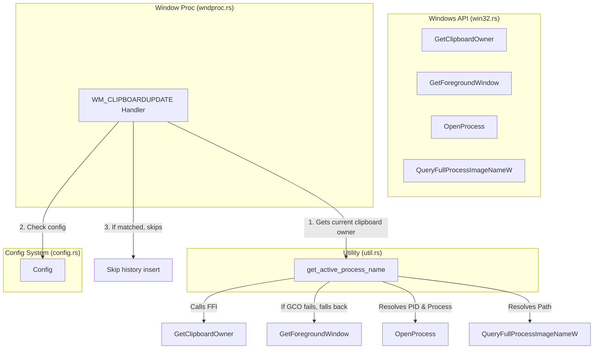

# Clipboard History Exclusion by Source Application Implementation Plan

> **For agentic workers:** REQUIRED SUB-SKILL: Use superpowers:subagent-driven-development to implement this plan task-by-task. Steps use checkbox (`- [ ]`) syntax for tracking.

**Goal:** Implement a feature in Clipper that intercepts clipboard updates and ignores entries copied from specified applications (like password managers `1Password` or `Bitwarden`) to prevent passwords and API keys from leaking into the history.

**Architecture:**
Expand the config file parsing to include `exclude_apps`. Expose key Windows APIs (`GetClipboardOwner`, `OpenProcess`, and `QueryFullProcessImageNameW`) to retrieve the source application executable name of any clipboard updates. Intercept `WM_CLIPBOARDUPDATE` messages to inspect the source application name, and skip saving if it matches any entry in `exclude_apps`.

**Architecture Diagram:**


**Tech Stack:**
- Rust (edition 2024)
- Win32 API (Raw FFI)
- Serde / TOML (for Configuration)

## Global Constraints
- Always use `rtk` prefix for compilation and testing commands.
- Maintain backward compatibility of `config.toml` using `#[serde(default = "...")]` attributes.
- Non-Windows builds must compile successfully by using appropriate `#[cfg(target_os = "windows")]` attributes and stub implementations.

---

## Tasks

### Task 1: Extend Config System
Add `exclude_apps` configuration field to the config schema and implement default values.

**Files:**
- Modify: [src/config.rs](file:///D:/Develop/clipper/src/config.rs)
- Test: [src/config.rs](file:///D:/Develop/clipper/src/config.rs) (within `mod tests` block)

**Interfaces:**
- Consumes: None
- Produces: `Config::exclude_apps: Vec<String>`

- [ ] **Step 1: Write the failing test**
  Add a test `test_parse_exclude_apps` in `mod tests` in [src/config.rs](file:///D:/Develop/clipper/src/config.rs) that parses a minimal TOML config and asserts the default `exclude_apps` values exist, and that a config containing custom `exclude_apps` parses correctly.

  Add code inside `mod tests`:
  ```rust
  #[test]
  fn test_parse_exclude_apps() {
      let minimal_toml = r#"
          font_name = "Segoe UI"
          max_rows = 10
      "#;
      let config: Config = toml::from_str(minimal_toml).unwrap();
      assert!(config.exclude_apps.contains(&"1Password.exe".to_string()));
      assert!(config.exclude_apps.contains(&"Bitwarden.exe".to_string()));

      let custom_toml = r#"
          font_name = "Segoe UI"
          max_rows = 10
          exclude_apps = ["custom.exe"]
      "#;
      let config_custom: Config = toml::from_str(custom_toml).unwrap();
      assert_eq!(config_custom.exclude_apps, vec!["custom.exe".to_string()]);
  }
  ```

- [ ] **Step 2: Run test to verify it fails**
  Run: `rtk cargo test --lib config::tests::test_parse_exclude_apps`
  Expected: Compile error because `exclude_apps` field does not exist on `Config`.

- [ ] **Step 3: Write minimal implementation**
  Add the `exclude_apps` field, its default function, and update `impl Default for Config` in [src/config.rs](file:///D:/Develop/clipper/src/config.rs).

  ```rust
  // Inside Config struct
  #[serde(default = "default_exclude_apps")]
  pub exclude_apps: Vec<String>,

  // Module level helper function
  fn default_exclude_apps() -> Vec<String> {
      vec![
          "1Password.exe".to_string(),
          "Bitwarden.exe".to_string(),
          "KeePassXC.exe".to_string(),
          "KeePass.exe".to_string(),
      ]
  }

  // Inside impl Default for Config
  exclude_apps: default_exclude_apps(),
  ```

- [ ] **Step 4: Run test to verify it passes**
  Run: `rtk cargo test`
  Expected: PASS (all tests pass)

- [ ] **Step 5: Commit changes**
  Run: `rtk git add src/config.rs && rtk git commit -m "feat: add exclude_apps to config"`

---

### Task 2: Declare Windows FFI Functions
Add FFI declarations for `GetClipboardOwner`, `OpenProcess`, and `QueryFullProcessImageNameW` in the Win32 module.

**Files:**
- Modify: [src/win32.rs](file:///D:/Develop/clipper/src/win32.rs)

**Interfaces:**
- Consumes: None
- Produces: FFI functions `GetClipboardOwner`, `OpenProcess`, `QueryFullProcessImageNameW` exposed from `win32` module.

- [ ] **Step 1: Write FFI definitions for Windows platform**
  Add definitions inside the `#[cfg(target_os = "windows")] mod windows` block (approx line 520, inside `#[link(name = "kernel32")] unsafe extern "system"` and standard user32 blocks).
  
  Note: `GetClipboardOwner` belongs to `user32` link block (around line 331).
  `OpenProcess` and `QueryFullProcessImageNameW` belong to `kernel32` link block (around line 520).

  In `user32` block:
  ```rust
  pub fn GetClipboardOwner() -> HWND;
  ```

  In `kernel32` block:
  ```rust
  pub fn OpenProcess(
      dwDesiredAccess: u32,
      bInheritHandle: BOOL,
      dwProcessId: u32,
  ) -> *mut c_void;
  pub fn QueryFullProcessImageNameW(
      hProcess: *mut c_void,
      dwFlags: u32,
      lpExeName: *mut u16,
      lpdwSize: *mut u32,
  ) -> BOOL;
  ```

- [ ] **Step 2: Write stub definitions for non-Windows platform**
  Add stub definitions inside the `#[cfg(not(target_os = "windows"))] mod windows` block (around line 915).
  ```rust
  pub unsafe fn GetClipboardOwner() -> HWND {
      std::ptr::null_mut()
  }
  pub unsafe fn OpenProcess(
      _dwDesiredAccess: u32,
      _bInheritHandle: i32,
      _dwProcessId: u32,
  ) -> *mut std::ffi::c_void {
      std::ptr::null_mut()
  }
  pub unsafe fn QueryFullProcessImageNameW(
      _hProcess: *mut std::ffi::c_void,
      _dwFlags: u32,
      _lpExeName: *mut u16,
      _lpdwSize: *mut u32,
  ) -> i32 {
      0
  }
  ```

- [ ] **Step 3: Run compiler check**
  Run: `rtk cargo check`
  Expected: Compilation succeeds without warnings/errors.

- [ ] **Step 4: Commit changes**
  Run: `rtk git add src/win32.rs && rtk git commit -m "feat: add win32 api declarations for process lookup"`

---

### Task 3: Implement Active Process Resolver
Create utility function `get_active_process_name()` to determine the name of the executable that wrote to the clipboard.

**Files:**
- Modify: [src/util.rs](file:///D:/Develop/clipper/src/util.rs)

**Interfaces:**
- Consumes: FFI functions in `win32` module.
- Produces: `pub fn get_active_process_name() -> Option<String>`

- [ ] **Step 1: Write the failing test / stub verification**
  Write a unit test `test_get_active_process_name` in [src/util.rs](file:///D:/Develop/clipper/src/util.rs) (at the bottom of the file inside tests).
  Since we cannot easily mock active windows in standard cargo test runners, we will verify it returns `Some` or `None` without crashing, and check compilation.
  ```rust
  #[test]
  fn test_get_active_process_name_compiles() {
      // Should not crash, and under test environment might return None or Some(process)
      let _name = get_active_process_name();
  }
  ```

- [ ] **Step 2: Verify test fails/compiles**
  Run: `rtk cargo test --lib util::tests::test_get_active_process_name_compiles`
  Expected: Compile error because `get_active_process_name` is not yet defined in `util.rs`.

- [ ] **Step 3: Implement `get_active_process_name`**
  Implement the function in [src/util.rs](file:///D:/Develop/clipper/src/util.rs):
  ```rust
  pub fn get_active_process_name() -> Option<String> {
      #[cfg(target_os = "windows")]
      unsafe {
          let mut hwnd = win32::GetClipboardOwner();
          if hwnd.is_null() {
              hwnd = win32::GetForegroundWindow();
          }
          if hwnd.is_null() {
              return None;
          }
          let mut pid: u32 = 0;
          win32::GetWindowThreadProcessId(hwnd, &mut pid);
          if pid == 0 {
              return None;
          }
          let process_handle = win32::OpenProcess(0x1000, 0, pid); // PROCESS_QUERY_LIMITED_INFORMATION
          if process_handle.is_null() {
              return None;
          }
          let mut buffer = vec![0u16; 1024];
          let mut size = buffer.len() as u32;
          let success = win32::QueryFullProcessImageNameW(process_handle, 0, buffer.as_mut_ptr(), &mut size);
          win32::CloseHandle(process_handle);
          if success != 0 {
              let path_str = String::from_utf16_lossy(&buffer[..size as usize]);
              let path = std::path::Path::new(&path_str);
              return path.file_name()
                  .and_then(|n| n.to_str())
                  .map(|s| s.to_string());
          }
      }
      None
  }
  ```

- [ ] **Step 4: Verify test passes**
  Run: `rtk cargo test`
  Expected: PASS

- [ ] **Step 5: Commit changes**
  Run: `rtk git add src/util.rs && rtk git commit -m "feat: implement get_active_process_name utility"`

---

### Task 4: Integrate Filter into Clipboard Listener
Modify the `WM_CLIPBOARDUPDATE` handler to block execution if the active process matches the `exclude_apps` list.

**Files:**
- Modify: [src/wndproc.rs](file:///D:/Develop/clipper/src/wndproc.rs)

**Interfaces:**
- Consumes: `util::get_active_process_name()`, `state::CONFIG`
- Produces: None (Modifies runtime behavior)

- [ ] **Step 1: Implement the exclusion check in `wndproc`**
  Modify [src/wndproc.rs](file:///D:/Develop/clipper/src/wndproc.rs) inside the `win32::WM_CLIPBOARDUPDATE` match branch.

  Replace:
  ```rust
          win32::WM_CLIPBOARDUPDATE => {
              if let Some(text) = util::get_clipboard_text()
                  && !text.is_empty()
              {
  ```

  With:
  ```rust
          win32::WM_CLIPBOARDUPDATE => {
              let is_excluded = if let Some(active_app) = util::get_active_process_name() {
                  state::CONFIG.get().map_or(false, |c| {
                      c.exclude_apps.iter().any(|app| {
                          app.eq_ignore_ascii_case(&active_app)
                      })
                  })
              } else {
                  false
              };

              if !is_excluded
                  && let Some(text) = util::get_clipboard_text()
                  && !text.is_empty()
              {
  ```

- [ ] **Step 2: Run compiler check & tests**
  Run: `rtk cargo check` and `rtk cargo test`
  Expected: All builds and unit tests pass.

- [ ] **Step 3: Commit changes**
  Run: `rtk git add src/wndproc.rs && rtk git commit -m "feat: filter clipboard updates by exclude_apps list"`

---

## Verification Plan
1. **Manual Run**:
   - Run `rtk cargo run` or `rtk cargo build --release`.
   - Modify the generated `config.toml` (which Clipper creates in `%APPDATA%/Clipper/config.toml`) to add a debug exclusion, e.g., `exclude_apps = ["notepad.exe"]`.
   - Open Notepad, type something, copy it.
   - Open Clipper (using history key, e.g. Ctrl) and verify that the text copied from Notepad does **not** appear in the history list.
   - Open any other editor (e.g., VS Code or Browser), copy something, and verify it **does** appear in Clipper history.
2. **Release Checks**:
   - Ensure `rtk cargo fmt` and `rtk cargo clippy` return clean results.
