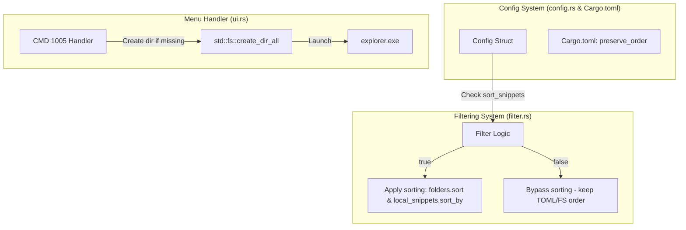

# Snippet Folder Fallback & Sorting Option Implementation Plan

> **For agentic workers:** REQUIRED SUB-SKILL: Use superpowers:subagent-driven-development to implement this plan task-by-task. Steps use checkbox (`- [ ]`) syntax for tracking.

**Goal:** Implement automatic creation of the snippets directory when opening it, and add a configuration option `sort_snippets` (default: `false`) to allow choosing between TOML definition order and alphabetical sorting.

**Architecture:**
Enable `preserve_order` on the `toml` crate to retain declaration order. Update the configuration schema to include `sort_snippets: bool`. In `ui.rs`, invoke `std::fs::create_dir_all` before launching Explorer for the snippets path. In `filter.rs`, modify the subdirectory and snippet formatting processes to conditionally execute alphabetical sorting based on `sort_snippets`.

**Architecture Diagram:**


**Tech Stack:**
- Rust (edition 2024)
- toml crate with `preserve_order` feature

## Global Constraints
- Always use `rtk` prefix for compilation and testing commands.
- Maintain backward compatibility of `config.toml` using `#[serde(default = "...")]` attributes.
- Ensure the app builds on all platforms.

---

## Tasks

### Task 1: Enable TOML Order & Add Config Options
Update Cargo dependency options and extend configuration fields.

**Files:**
- Modify: [Cargo.toml](file:///D:/Develop/clipper/Cargo.toml)
- Modify: [src/config.rs](file:///D:/Develop/clipper/src/config.rs)
- Test: [src/config.rs](file:///D:/Develop/clipper/src/config.rs) (within `mod tests` block)

**Interfaces:**
- Consumes: None
- Produces: `Config::sort_snippets: bool`

- [ ] **Step 1: Write the failing test**
  Add a test `test_parse_sort_snippets` inside `mod tests` in [src/config.rs](file:///D:/Develop/clipper/src/config.rs):
  ```rust
  #[test]
  fn test_parse_sort_snippets() {
      let minimal_toml = r#"
          font_name = "Segoe UI"
          max_rows = 10
      "#;
      let config: Config = toml::from_str(minimal_toml).unwrap();
      assert_eq!(config.sort_snippets, false); // Default must be false

      let custom_toml = r#"
          font_name = "Segoe UI"
          max_rows = 10
          sort_snippets = true
      "#;
      let config_custom: Config = toml::from_str(custom_toml).unwrap();
      assert_eq!(config_custom.sort_snippets, true);
  }
  ```

- [ ] **Step 2: Run test to verify it fails**
  Run: `rtk cargo test --lib config::tests::test_parse_sort_snippets`
  Expected: Compile error because `sort_snippets` field does not exist on `Config`.

- [ ] **Step 3: Write minimal implementation**
  - Enable `preserve_order` on `toml` crate in [Cargo.toml](file:///D:/Develop/clipper/Cargo.toml#L8):
    ```toml
    toml = { version = "0.8", features = ["preserve_order"] }
    ```
  - Implement the field, its default helper, and Default initialization in [src/config.rs](file:///D:/Develop/clipper/src/config.rs):
    ```rust
    // In Config struct
    #[serde(default = "default_sort_snippets")]
    pub sort_snippets: bool,

    // Module level default function
    fn default_sort_snippets() -> bool {
        false
    }

    // Inside impl Default for Config
    sort_snippets: false,
    ```
  - Update pre-existing tests `test_parse_minimal_config` and `test_parse_full_config` to assert `sort_snippets`.
    - In `test_parse_minimal_config`, assert `config.sort_snippets == false`.
    - In `test_parse_full_config`, add `sort_snippets = true` to TOML input and assert `config.sort_snippets == true`.

- [ ] **Step 4: Run test to verify it passes**
  Run: `rtk cargo test`
  Expected: PASS

- [ ] **Step 5: Commit changes**
  Run: `rtk git add Cargo.toml src/config.rs && rtk git commit -m "feat: add sort_snippets to config and enable toml preserve_order"`

---

### Task 2: Implement Snippet Folder Auto-creation Fallback
Ensure the folder is generated when clicked, preventing Windows Explorer errors.

**Files:**
- Modify: [src/ui.rs](file:///D:/Develop/clipper/src/ui.rs)

**Interfaces:**
- Consumes: `util::get_app_dir()`
- Produces: None (Modifies side-effect behavior)

- [ ] **Step 1: Implement directory auto-creation**
  In [src/ui.rs](file:///D:/Develop/clipper/src/ui.rs#L709-L711), locate `cmd == 1005`.
  Add `std::fs::create_dir_all(&path)` before launching Explorer:
  ```rust
      } else if cmd == 1005 {
          let path = util::get_app_dir().join("snippets");
          let _ = std::fs::create_dir_all(&path);
          let _ = std::process::Command::new("explorer").arg(path).spawn();
      }
  ```

- [ ] **Step 2: Run compiler check**
  Run: `rtk cargo check`
  Expected: Compilation succeeds.

- [ ] **Step 3: Commit changes**
  Run: `rtk git add src/ui.rs && rtk git commit -m "feat: automatically create snippets directory on open folder"`

---

### Task 3: Implement Conditional Snippet Sorting
Control sorting in the UI representation of snippets and folders based on config.

**Files:**
- Modify: [src/filter.rs](file:///D:/Develop/clipper/src/filter.rs)

**Interfaces:**
- Consumes: `state::CONFIG` (specifically `sort_snippets`)
- Produces: None (Modifies display order)

- [ ] **Step 1: Apply conditional sorting for subdirectories and snippets**
  Modify [src/filter.rs](file:///D:/Develop/clipper/src/filter.rs#L57-L77).

  Replace:
  ```rust
                  // Add sorted subdirectories
                  let mut folders: Vec<String> = folder_names.into_iter().collect();
                  folders.sort();
                  for f in folders {
                      display_items.push(format!("[DIR] {}", f));
                      if cur_folder.is_empty() {
                          let escaped = f.replace('/', "\\/");
                          full_paths.push(format!("dir:{}", escaped));
                      } else {
                          let escaped = f.replace('/', "\\/");
                          full_paths.push(format!("dir:{}/{}", cur_folder, escaped));
                      }
                  }

                  // Add sorted snippets
                  local_snippets.sort_by(|a, b| a.1.cmp(&b.1));
                  for (full_path, display_name) in local_snippets {
                      display_items.push(format!("[SNIP] {}", display_name));
                      full_paths.push(full_path.to_string());
                  }
  ```

  With:
  ```rust
                  let sort_snippets = state::CONFIG.get().map_or(false, |c| c.sort_snippets);

                  // Add subdirectories (conditionally sorted)
                  let mut folders: Vec<String> = folder_names.into_iter().collect();
                  if sort_snippets {
                      folders.sort();
                  }
                  for f in folders {
                      display_items.push(format!("[DIR] {}", f));
                      if cur_folder.is_empty() {
                          let escaped = f.replace('/', "\\/");
                          full_paths.push(format!("dir:{}", escaped));
                      } else {
                          let escaped = f.replace('/', "\\/");
                          full_paths.push(format!("dir:{}/{}", cur_folder, escaped));
                      }
                  }

                  // Add snippets (conditionally sorted)
                  if sort_snippets {
                      local_snippets.sort_by(|a, b| a.1.cmp(&b.1));
                  }
                  for (full_path, display_name) in local_snippets {
                      display_items.push(format!("[SNIP] {}", display_name));
                      full_paths.push(full_path.to_string());
                  }
  ```

- [ ] **Step 2: Run compiler check & tests**
  Run: `rtk cargo check` and `rtk cargo test`
  Expected: PASS

- [ ] **Step 3: Commit changes**
  Run: `rtk git add src/filter.rs && rtk git commit -m "feat: conditionally sort snippets and directories based on sort_snippets"`

---

## Verification Plan
1. **Directory Auto-Creation Check**:
   - Delete the `%APPDATA%\clipper\snippets` folder manually.
   - Run Clipper and select "Open Snippets Folder" in the tray menu.
   - Verify the folder is successfully re-created and opened in Explorer.
2. **Snippet Definition Order Check**:
   - Open `%APPDATA%\clipper\snippets\snippets.toml` (or create it if it doesn't exist).
   - Write snippets in non-alphabetical order, e.g.:
     ```toml
     zebra = "Zebra"
     apple = "Apple"
     ```
   - Reload configuration in Clipper.
   - Open Clipper Snippets list. Verify `zebra` displays *before* `apple` (TOML sequence).
   - Update `config.toml` to set `sort_snippets = true`. Reload configuration.
   - Open Snippets list again. Verify `apple` displays *before* `zebra` (alphabetical sequence).
3. **Release Checks**:
   - Verify formatting with `rtk cargo fmt`.
   - Run `rtk cargo clippy` to check for warnings.
