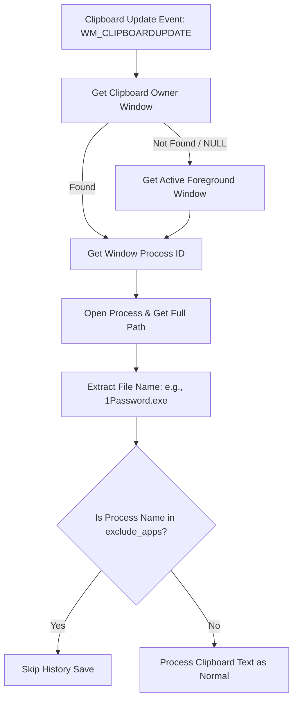

# Design Spec: Exclude Clipboard History by Source Application

## 1. Background & Requirements
- **Goal**: Prevent passwords and API keys copied from specific applications (such as password managers) from being saved to the Clipper history.
- **Scope**: Identify the application that wrote to the clipboard (e.g., `1Password.exe`, `Bitwarden.exe`). If it matches the configured exclusion list (`exclude_apps`), skip adding it to the history VecDeque and saving it to the filesystem.
- **Accuracy**: Directly identify the clipboard owner window where possible using Windows API, falling back to the active foreground window if the owner window is not retrievable.

---

## 2. Architecture & Data Flow

---

## 3. Implementation Details

### 3.1. Config System
Add `exclude_apps` parameter to configuration.

- **Files affected**:
  - `config.toml` (Default config output)
  - [src/config.rs](file:///D:/Develop/clipper/src/config.rs)

**Changes in `config.rs`:**
- Add `exclude_apps: Vec<String>` to `Config` struct.
- Introduce `default_exclude_apps()` which returns:
  - `1Password.exe`
  - `Bitwarden.exe`
  - `KeePassXC.exe`
  - `KeePass.exe`
- Add backward compatibility default using `#[serde(default = "default_exclude_apps")]`.

---

### 3.2. Win32 FFI declarations
Expose necessary Windows API functions for process name lookup.

- **Files affected**:
  - [src/win32.rs](file:///D:/Develop/clipper/src/win32.rs)

**Changes in `win32.rs` (`target_os = "windows"` module):**
- Add `GetClipboardOwner` FFI mapping.
- Add `OpenProcess` FFI mapping.
- Add `QueryFullProcessImageNameW` FFI mapping.
- Constant: `PROCESS_QUERY_LIMITED_INFORMATION` (`0x1000`).

**Changes in `win32.rs` (`not(target_os = "windows")` module):**
- Add matching stub functions returning `null` or `0` for fallback platforms.

---

### 3.3. Active Process Helper
Implement the logic to resolve the clipboard owner's executable name.

- **Files affected**:
  - [src/util.rs](file:///D:/Develop/clipper/src/util.rs)

**New function `get_active_process_name() -> Option<String>`:**
- Fetch owner window via `GetClipboardOwner()`. If `null`, fetch active window via `GetForegroundWindow()`.
- Retrieve PID using `GetWindowThreadProcessId()`.
- Open process with `PROCESS_QUERY_LIMITED_INFORMATION` access right.
- Resolve path using `QueryFullProcessImageNameW()`.
- Convert the UTF-16 path to Rust `String` and extract the filename.

---

### 3.4. History Update Logic
Intercept history saving under `WM_CLIPBOARDUPDATE`.

- **Files affected**:
  - [src/wndproc.rs](file:///D:/Develop/clipper/src/wndproc.rs)

**Changes in `wndproc.rs`:**
- In `WM_CLIPBOARDUPDATE` handler, invoke `util::get_active_process_name()`.
- Compare it (case-insensitive) against `exclude_apps` defined in the config.
- If excluded, bypass the rest of the clipboard saving logic.

---

## 4. Test Plan
1. **Unit Tests**:
   - Add unit test for the configuration parsing in [src/config.rs](file:///D:/Develop/clipper/src/config.rs) to ensure `exclude_apps` loads correctly with default fallback values.
2. **Manual Verification**:
   - Build clipper: `rtk cargo build`.
   - Copy a password from a simulated process or add a generic application (like `notepad.exe` or terminal `powershell.exe`) to the `exclude_apps` configuration to verify it gets blocked correctly from history.
